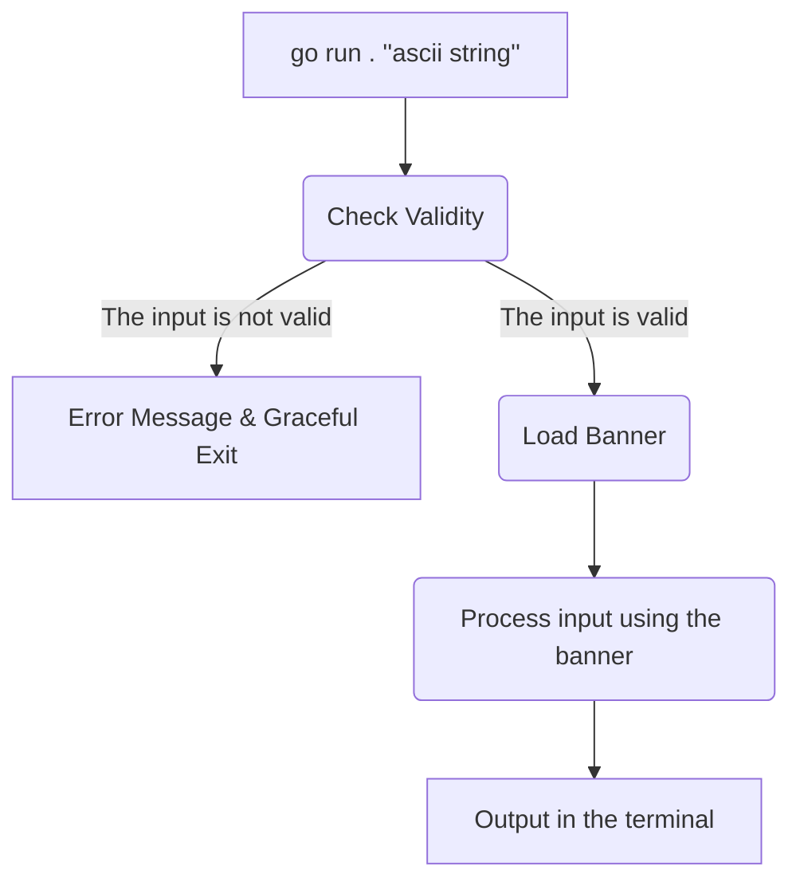

                          _   _                           _    
                         (_) (_)                         | |
      __ _   ___    ___   _   _   ______    __ _   _ __  | |_
     / _` | / __|  / __| | | | | |______|  / _` | | '__| | __|
    | (_| | \__ \ | (__  | | | |          | (_| | | |    \ |_
     \__,_| |___/  \___| |_| |_|           \__,_| |_|     \__|

# Welcome to ascii-art!

A Go project for Zone01 Athens, by *ustikker*, *imichalop* and *ivossos* that converts input strings into ASCII art. The program takes a string and outputs its ASCII art representation using a standard banner font.

## What is ASCII art?

ASCII art is a form of visual expression that uses characters from the ASCII (American Standard Code for Information Interchange) character set to create images, patterns, or designs. These characters include letters, numbers, punctuation marks, and symbols. ASCII art was popularized in the early days of computers and digital communication when graphical displays were limited or non-existent. Artists used text-based characters to represent shapes and pictures, often creating intricate designs with just a keyboard. It remains a nostalgic and creative medium, frequently seen in email signatures, online forums, and even coding communities.

## Features

-   **Text to ASCII Art Conversion**: Transform any ASCII string into stylized ASCII art.
-   **Newline Support**: Use `\n` within your input to create multi-line ASCII art.
-   **Input Validation**: Ensures only valid ASCII characters are processed.
-  **Multiple Banner Support**: If, in main.go, you change *loadBanner("standard.txt")* to *loadBanner("shadow.txt")* or *loadBanner("thinkertoy.txt")*, you will get a different art style.

## Layout of the Project

## Getting Started

### Prerequisites

-   Go installed on your machine (version 1.16 or later).

### Installation

1.  **Clone the repository**:
      
    `git clone https://platform.zone01.gr/git/ustikker/ascii-art.git` 
    
2.  **Navigate to the project directory**:
    
       `cd ascii-art-generator` 
    
3.  **Build the project**:

	 `go build -o asciiart` 
    
    This will create an executable named `asciiart`. Note that this is for Unix based systems. If you are using Windows, please use `asciiart.exe` instead. The same applies to the following sections as well.
    

## Usage

Run the program by providing a single argument enclosed in quotes:

`./asciiart "Your text here"` 

### Examples

#### Example 1: Simple Text

**Command**:

`./asciiart "Hello"` 

**Output**:

     _    _          _   _          
    | |  | |        | | | |         
    | |__| |   ___  | | | |   ___   
    |  __  |  / _ \ | | | |  / _ \  
    | |  | | |  __/ | | | | | (_) | 
    |_|  |_|  \___| |_| |_|  \___/  
                                

#### Example 2: Text with Newlines

**Command**:

`./asciiart "Hello\nWorld"` 

**Output**:

     _    _          _   _
    | |  | |        | | | |
    | |__| |   ___  | | | |   ___
    |  __  |  / _ \ | | | |  / _ \
    | |  | | |  __/ | | | | | (_) |
    |_|  |_|  \___| |_| |_|  \___/
    
    
    __          __                 _       _
    \ \        / /                | |     | |
     \ \  /\  / /    ___    _ __  | |   __| |
      \ \/  \/ /    / _ \  | '__| | |  / _` |
       \  /\  /    | (_) | | |    | | | (_| |
        \/  \/      \___/  |_|    |_|  \__,_|
                               
                               

### Handling Special Characters

The program only supports standard ASCII characters. If you input characters outside this range, you'll receive an error message:

`Error: Only ASCII characters or newline symbols (\n) are allowed.` 

### Input Validation

-   Ensure you provide exactly one argument. If you provide none or multiple arguments, the program will prompt:
    
    `Error: Please provide exactly one argument.` 
    

## Project Structure

-   **`main.go`**: The entry point of the application. It orchestrates input validation, banner loading, and processing the input string.
-   **`validation.go`**: Contains functions to check the validity of the input.
-   **`banner.go`**: Loads the ASCII art font from `standard.txt` and maps each character to its ASCII art representation.
-   **`asciiart.go`**: Processes the input string and builds the ASCII art output.
-   **`standard.txt`**: The font file containing ASCII art representations of characters.
-   **`main_test.go`**: Unit tests to verify the functionality of the application.

## Running Tests

`go test` 

This will execute the tests defined in `main_test.go` and confirm that all features are working as expected. Please note that these tests are designed to run with the default option of *standard.txt* banner.

## Learning Points

While working with this project, we learned about:

-   **Command-Line Arguments**: How to handle and validate input from the command line using `os.Args`.
-   **File Reading**: Loading and parsing data from files with `os.ReadFile`.
-   **String Manipulation**: Using functions from the `strings` package to process and modify strings.
-   **Maps and Slices**: Storing and accessing data using Go's map and slice data structures.
-   **Error Handling**: Implementing checks and handling errors gracefully to ensure the program runs smoothly.
-   **Unit Testing**: Writing tests to verify that each part of your program works correctly.

## Acknowledgments

-   Thanks to all the amazing students of Zone01 Athens who give their best selves every day, and the awesome people who take the time to audit others. Cheers!

                     __ 
                    (__)
                   <____>
                    )--(
                   /\/\/\
                  /\/\/\/\
                  \/\/\/\/
                  /\/\/\/\
                 /\/\/\/\/\    .----------.
                //\\//\\//\\   \~~~~~~~~~~/
               /\\//\\//\\//\   \/\/\/\/\/
              |\//\\//\\//\\/|   \/\/\/\/
              |/\\//\\//\\//\|    \/\/\/
               \/\/\/\/\/\/\/      ~||~
                \/\/\/\/\/\/        ||
                 `---------'      __||__
                                 `------'

